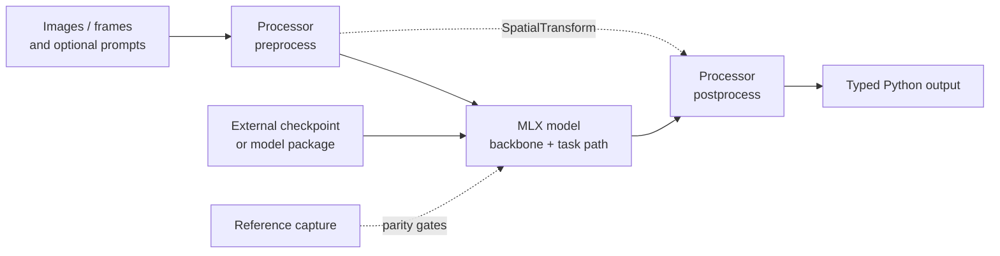

<div align="center">

# mlx-cv

### Parity-driven computer vision on Apple Silicon

An inference-only Python library for MLX-native grounding, detection, depth,
segmentation, and video object tracking.

[](https://pypi.org/project/mlx-cv/)
[](pyproject.toml)
[](https://github.com/ml-explore/mlx)
[](#project-status)
[](LICENSE)

**[Website](https://appautomaton.renocrypt.com/mlx-cv/)** ·
[PyPI](https://pypi.org/project/mlx-cv/) ·
[Architecture](docs/ARCHITECTURE.md)

</div>

> [!IMPORTANT]
> `mlx-cv` is pre-alpha. The model implementations and parity evidence are real,
> and the public loader/result/visualization contracts now cover every supported
> family. Model weights remain external artifacts.

## What is implemented

<table>
<tr>
<td width="50%" valign="top">

### LocateAnything-3B

Text-prompted visual grounding with boxes, points, labels, MoonViT vision
features, Qwen2.5 language decoding, and Parallel Box Decoding.

**Output:** shared `Result`<br>
**Checkpoint:** final-layout BF16 package<br>
**Evidence:** real upstream comparison passed

</td>
<td width="50%" valign="top">

### RF-DETR Nano

COCO object detection through a DINOv2 backbone, multi-scale projector,
deformable attention, and a two-stage DETR decoder.

**Output:** shared `Result`<br>
**Checkpoint:** converted local MLX weights<br>
**Evidence:** real upstream comparison passed

</td>
</tr>
<tr>
<td width="50%" valign="top">

### Depth Anything V3

Monocular depth plus the DA3-SMALL multi-view path for depth, confidence,
camera intrinsics, and camera extrinsics.

**Output:** shared `Result`<br>
**Checkpoint:** converted local MLX weights<br>
**Evidence:** real DA3-SMALL comparison passed

</td>
<td width="50%" valign="top">

### SAM 3.1

Text-prompted image segmentation, plus stateful video propagation with point,
box, and mask prompts through Object Multiplex tracking.

**Output:** shared `Result` / `VideoResult`<br>
**Checkpoint:** combined 1963-tensor BF16 package<br>
**Evidence:** image and video Metal comparisons passed

</td>
</tr>
<tr>
<td colspan="2" valign="top">

### EoMT–DINOv3 Small 640

COCO panoptic segmentation through a DINOv3-small backbone, query insertion in
the final transformer blocks, mask classification, and learned 4× feature
upscaling.

**Output:** shared panoptic `Result` with segment metadata<br>
**Checkpoint:** official full Transformers Safetensors package or converted local weights<br>
**Evidence:** recorded 12-block CPU and Metal panoptic parity, now gate-covered

</td>
</tr>
</table>

## Architecture



The stable core is intentionally small:

- **Typed results** for detections, masks, points, depth, camera geometry, and tracks.
- **`SpatialTransform`** for deterministic coordinate and dense-output inversion.
- **Reusable MLX blocks** for ViT, DINOv2, DINOv3, MoonViT, Qwen2.5, dense heads, and DETR-style decoding.
- **Processors and sessions** that keep image I/O, prompts, and temporal state outside compute modules.
- **One lazy loader catalog** exposed through `mlx_cv.load(...)` without making the package root import MLX.
- **Pillow visualization** through `Result.draw()` for boxes, masks, points, keypoints, tracks, and depth.
- **Repository parity tooling** under `tools/` that distinguishes local fixture
  coverage from a real upstream comparison without entering the runtime wheel.

See [Architecture](docs/ARCHITECTURE.md) for the implemented module boundaries and
known gaps.

## Installation

`mlx-cv` requires Python 3.13 or newer. The base package stays import-light and
depends only on NumPy and Pillow.

The project is pre-alpha and the public API still moves, so an editable install
from a checkout is the recommended path. It keeps you on the same code the
parity ledger, `docs/`, and this README describe:

```bash
git clone https://github.com/appautomaton/mlx-cv
cd mlx-cv
python -m pip install -e ".[mlx]"
```

Released versions are published to [PyPI](https://pypi.org/project/mlx-cv/) and
install the same way, but they lag `main` and carry whatever API was current
when they were cut:

```bash
pip install "mlx-cv[mlx]"
```

The `mlx` extra pulls in the MLX runtime that executes models. Add `hub` when
resolving a remote snapshot or loading a self-contained LocateAnything package
(`".[mlx,hub]"`). Installing with no extras gives you the typed result,
transform, and package contracts without a runtime.

Local package directories are resolved without importing Hugging Face Hub.
Remote resolution is revision-aware, honors `HF_HUB_OFFLINE=1`, and never
executes Python code from a model repository.

## Unified loading

Every supported runtime is available through the same lazy entry point. A local
package is a directory containing `config.json`, `model.safetensors` or
`model.npz`, and any model-specific runtime assets.

```python
import mlx_cv

locate = mlx_cv.load(
    "locateanything-3b",
    "/path/to/locateanything-package"
)
grounding = locate.predict(image, "find every traffic sign")

detector = mlx_cv.load("rfdetr-nano", "/path/to/rfdetr-package")
detections = detector.predict(image)

depth = mlx_cv.load(
    "depth-anything-v3-multiview",
    "/path/to/da3-small-package",
)
geometry = depth.predict(images)

eomt = mlx_cv.load("eomt-dinov3")
panoptic = eomt.predict(image)

sam_image = mlx_cv.load("sam3.1-image", "/path/to/sam31-package")
segments = sam_image.predict(image, "traffic sign")

sam_video = mlx_cv.load("sam3.1-video", "/path/to/sam31-package")
```

The underlying model classes also expose `from_pretrained(...)`. Package layouts
and direct-checkpoint requirements are documented in
[Model packages](docs/model-packages.md). Local paths use the same package
contract. EoMT's configured default resolves its official external repository;
the other runtimes require an explicit package path or exact repository ID.

## Verification status

The earlier model families retain their canonical evidence ledger in
`.agent/work/2026-06-16-release-parity-hardening/parity-status.json`. EoMT-DINOv3
is covered by its current reproducible real-checkpoint gate and
[implementation notes](docs/eomt-dinov3.md).

| Runtime | Verified surface | Recorded result |
|---|---|---|
| LocateAnything-3B | parameter conversion, boxes, points, selected taps, generated tokens | `UPSTREAM_PASSED` |
| RF-DETR Nano | real COCO checkpoint load and upstream/local detection comparison | `UPSTREAM_PASSED` |
| DA3-SMALL | multi-view depth, confidence, cameras, and selected taps | `UPSTREAM_PASSED` |
| EoMT–DINOv3 Small 640 | full official checkpoint, 12 block taps, final mask/class logits, panoptic output | 12 CPU block taps and logits passed; Metal panoptic pixels 99.9899% aligned |
| SAM 3.1 image | detector, masks, boxes, and scores on MLX Metal | mask IoU 0.999618 |
| SAM 3.1 video | Object Multiplex components and real two-frame propagation | multiplex mask IoU 0.99215 |

Normal checkpoint-free CI exercises unit tests and committed fixtures. Heavy
real-checkpoint gates are explicit opt-in checks; a skipped external gate is
never promoted into a parity claim.

## Development and test artifacts

Generated files do not belong in the repository. Use an isolated system
temporary directory for pytest state, caches, build outputs, downloads, and
debug artifacts:

```bash
MLX_CV_TEST_ROOT="$(mktemp -d "${TMPDIR:-/tmp}/mlx-cv-tests.XXXXXX")"
trap 'rm -rf "$MLX_CV_TEST_ROOT"' EXIT

PYTHONDONTWRITEBYTECODE=1 \
UV_CACHE_DIR="$MLX_CV_TEST_ROOT/uv-cache" \
python -m pytest -q \
  --basetemp="$MLX_CV_TEST_ROOT/pytest" \
  -o "cache_dir=$MLX_CV_TEST_ROOT/pytest-cache"
```

Tracked files under `tests/fixtures/` are deterministic regression inputs, not
generated test output. Upstream reference checkouts and model weights also stay
outside the Git tree.

## Project status

The public inference surface is now consistent across the implemented families:

- `mlx_cv.available_models()` reports the canonical lazy-loader catalog;
- `mlx_cv.load(...)` dispatches package loading without importing every model;
- image models return `Result`, while SAM video propagation returns `VideoResult`;
- `Result.draw()` returns a new RGB Pillow image and does not mutate its input;
- all five families accept standard local packages through `from_pretrained(...)`.

Weights are not bundled, training and serving are out of scope, and the API is
still pre-alpha. The admitted EoMT surface is the COCO panoptic small-640 model;
larger variants and dataset evaluation are not implied.

The current work order lives in [the roadmap](.agent/steering/ROADMAP.md).
Historical specs, plans, reviews, and evidence remain intact under
`.agent/work/`.

## Documentation

- [Current architecture](docs/ARCHITECTURE.md)
- [Depth Anything V3](docs/depth-anything-v3.md)
- [SAM 3.1 image and Object Multiplex](docs/sam3-video.md)
- [EoMT–DINOv3 panoptic segmentation](docs/eomt-dinov3.md)
- [Local model packages](docs/model-packages.md)
- [Reference implementation policy](references/README.md)

## License

The library code is [MIT licensed](LICENSE). Model weights are external artifacts
and retain their upstream licenses: NVIDIA's LocateAnything license, Apache-2.0
for the selected RF-DETR and DA3 weights, MIT for the EoMT package, and the SAM
License for SAM 3.1.
