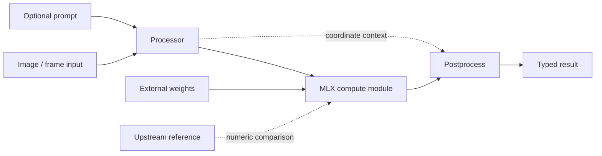

# mlx-cv architecture

## Status

This document describes the implementation currently present in `src/mlx_cv/`.
It is not a future model survey or a pre-implementation blueprint.

`mlx-cv` is an inference-only Python library for MLX-native computer vision. Its
core design goal is to keep spatial contracts, reusable compute blocks, model
orchestration, checkpoint conversion, and parity evidence separate enough that
each can be inspected and tested independently.

## System shape



The implementation is organized around five boundaries:

1. **Core contracts** define results, feature layouts, spatial transforms,
   registries, and lightweight protocols.
2. **Reusable compute** implements shared backbones, heads, and operations.
3. **Model families** assemble compute with model-specific processors,
   conversion rules, prediction methods, or video sessions.
4. **Hub and checkpoint utilities** resolve local/remote packages and validate
   final-layout artifacts without importing reference frameworks at runtime.
5. **Repository tools** compare parity, capture upstream outputs, convert source
   checkpoints, and stage releases outside the installable package.

## Package map

```text
src/mlx_cv/
├── loading.py            lazy public model-loader catalog and dispatch
├── viz.py                Pillow rendering for shared results
├── core/                 typed outputs, spatial transforms, registries, protocols
├── transforms/           resize, letterbox, normalization
├── ops/                  boxes, coordinates, sampling, deformable attention
├── backbones/
│   ├── layers/           reusable transformer primitives
│   ├── vision/           DINOv2, DINOv3, MoonViT, shared ViT pieces
│   └── llm/              Qwen2.5 decoder and cache/mask support
├── heads/                dense depth and detection components
├── models/
│   ├── locateanything/   grounding VLM and package pipeline
│   ├── rfdetr/           RF-DETR Nano detection
│   ├── depth_anything_v3/ monocular and multi-view depth
│   ├── eomt_dinov3/      EoMT-DINOv3 panoptic segmentation
│   └── sam3/             SAM 3.1 image and Object Multiplex video
├── hub/                  runtime conversion, resolution, Safetensors, packages
└── prompts/              lightweight prompt value types
```

Repository-only code is deliberately outside that tree:

```text
tools/
├── parity/                       fixtures, bisection, real-model local capture
├── eomt_reference.py             Transformers EoMT reference capture
└── huggingface_release.py        package staging, verification, publication
```

There is no training stack, server, or command-line application in the public
runtime. Model orchestration remains inside each family rather than a separate
`pipelines/` package.

## Core contracts

### Typed outputs

`core/types.py` provides NumPy-backed dataclasses for detections, masks, points,
keypoints, depth, camera geometry, embeddings, and tracks.

All supported image paths return the shared `Result`: LocateAnything, RF-DETR,
Depth Anything V3, EoMT–DINOv3, and SAM 3.1 image mode. EoMT populates a
panoptic `Masks` value plus ordered `segments_info` metadata. SAM video
propagation returns a `VideoResult` whose ordered frames are also `Result`
instances with masks and tracks. The former SAM-specific result names remain
aliases to `Result` during the pre-alpha transition.

`Result` supports JSON-compatible serialization and a detection-focused COCO
representation. `Result.draw()` lazily imports the Pillow renderer in `viz.py`
and returns a new RGB image for populated boxes, masks, points, keypoints,
tracks, or depth.

### Spatial transforms

`core/geometry.py` owns coordinate discipline. A `SpatialTransform` records the
resize, padding, or crop relationship between an original image and model input.
It can apply or invert points, boxes, masks, depth maps, heatmaps, and other
dense outputs.

Processors are responsible for creating the transform during preprocessing and
using it during postprocessing. This prevents model implementations from
silently returning coordinates in incompatible frames.

### Compute versus orchestration

The intended separation is:

- **MLX modules** perform tensor computation.
- **Processors** own input normalization and output decoding.
- **Pipelines/predict methods** compose a processor with a model.
- **Sessions** own temporal state for video.
- **Tools** perform reference capture, conversion, package staging, and demos.

`core/base.py` defines abstract or protocol-level contracts for processors,
predictors, trackers, heads, and vision/language backbones. Concrete model code
uses these as structural contracts; concrete inheritance is not required.

### Registries

`core/registry.py` provides compute-module, backbone, and head registries plus
third-party entry-point loading. `loading.py` adds a separate uniform registry
for user-facing pretrained runtimes.

`MODEL_LOADERS` stores import strings rather than concrete MLX classes. This
keeps `import mlx_cv` MLX-free while allowing `mlx_cv.load(...)` to dispatch all
supported families through the same `from_pretrained(...)` contract. Canonical
keys are discoverable through `mlx_cv.available_models()`.

## Implemented model families

| Family | Primary runtime path | Output contract | Checkpoint contract |
|---|---|---|---|
| LocateAnything-3B | MoonViT + projector + Qwen2.5 + PBD | shared `Result` with boxes/points | 769-tensor final-layout BF16 package |
| RF-DETR Nano | DINOv2 + multi-scale projector + DETR decoder | shared `Result.detections` | converted local MLX checkpoint |
| Depth Anything V3 | DINOv2/AnyView + DPT/DualDPT + camera head | shared depth/camera `Result` | converted DA3-SMALL checkpoint |
| EoMT–DINOv3 Small 640 | DINOv3 + final-block queries + mask/class heads | shared panoptic `Result.masks` | official full Transformers package or converted MLX checkpoint |
| SAM 3.1 image | vision/text encoders + detector + mask decoder | shared `Result` with detections/masks | detector subtree of combined BF16 checkpoint |
| SAM 3.1 video | detector features + memory encoder/attention + Object Multiplex | `VideoResult` with per-frame masks/tracks | tracker subtree of combined BF16 checkpoint |

DINOv2, DINOv3, MoonViT, and Qwen2.5 are reusable internal backbones. Their
presence does not imply a standalone end-user model loader for each backbone.

## Model loading and external artifacts

The runtime package never imports PyTorch, Transformers, or local upstream
checkouts as required dependencies.

Every supported family exposes a package-native `from_pretrained` entry point.
The shared resolver accepts:

- an existing local path without importing `huggingface_hub`;
- a configured alias;
- an exact repository ID;
- an optional revision, cache directory, token, and offline mode.

The resolver downloads files only. It exposes no `trust_remote_code` option and
does not execute Python from model repositories.

RF-DETR, DA3, and EoMT packages accept `model.safetensors` or `model.npz` plus a
normalized `config.json`. EoMT also accepts the current complete official
Transformers package and performs a bounded, validated key/layout conversion;
it does not execute Transformers code. LocateAnything and SAM add their
tokenizer or BPE assets. Large checkpoints, converted weights, reference
repositories, and generated package roots stay outside Git. Other
source-format conversion remains an explicit offline tool operation.

## Parity and evidence

Parity has two deliberately different levels:

1. **Committed fixture coverage** validates deterministic local behavior in CI.
2. **Real-checkpoint gates** compare upstream and MLX outputs when external
   source code, checkpoints, and suitable hardware are explicitly available.

A fixture pass does not imply upstream parity. Missing external prerequisites
produce a skip or precise blocker in normal development. Required-gate mode
turns those missing prerequisites into failures.

The earlier model families retain a dated status ledger at
`.agent/work/2026-06-16-release-parity-hardening/parity-status.json`. EoMT has a
separate current real-checkpoint gate documented in `docs/eomt-dinov3.md`.
Historical specs, plans, reviews, and gate evidence remain under `.agent/work/`
and must be read as dated records rather than current API documentation.

## Dependency boundary

The base package requires only NumPy and Pillow. MLX execution and Hub access
are the only user-facing optional extras. Test, publishing, and upstream
reference dependencies belong to developer environments and are not package
metadata.

Parity helpers and release orchestration live under `tools/`, not
`src/mlx_cv/`, so Hatch cannot include them in the `mlx-cv` wheel. Runtime code
must not import repository-only `tools` modules.

The top-level `mlx_cv` import remains MLX-free. Concrete MLX model packages load
the runtime only when imported. Runtime source files must not inject reference
paths or hard-import Torch, Transformers, reference repositories, or network
clients.

## Current limits

- Model weights remain external and are never bundled with the wheel.
- The API is pre-alpha and does not promise compatibility yet.
- Visualization produces still Pillow images; video encoding is not part of the
  runtime.
- Training, serving, dataset evaluation, and export pipelines remain out of
  scope.
- LocateAnything currently processes one image per result and its PBD generator
  supports batch size one with the reference six-token box frame.
- RF-DETR support is the Nano detection runtime. Segmentation checkpoints and
  other variants are rejected rather than partially loaded.
- Depth Anything V3 support is the documented monocular path and DA3-SMALL
  any-view depth/camera path; streaming, metric/nested, and Gaussian-splatting
  branches are not implemented.
- SAM image inference is text-prompted. Box, point, and mask prompts belong to
  the video session; image-mode geometry box prompting still lacks a verified
  MLX `roi_align` path.
- The admitted EoMT runtime is COCO panoptic small-640, one image per processor
  call. Semantic-only APIs, COCO panoptic serialization, larger variants, and
  dataset evaluation remain out of scope.
- There is no general quantized-checkpoint loading contract. LocateAnything and
  SAM use their verified final-layout BF16 packages.

## Sources of truth

- `README.md`: user-facing supported surface and current status.
- `docs/ARCHITECTURE.md`: implemented boundaries and known gaps.
- `docs/depth-anything-v3.md`: selected DA3 contract.
- `docs/sam3-video.md`: selected SAM 3.1 contract.
- `docs/eomt-dinov3.md`: selected EoMT runtime and evidence.
- `.agent/steering/ROADMAP.md`: current work order only.
- `.agent/work/`: immutable historical work and evidence.
